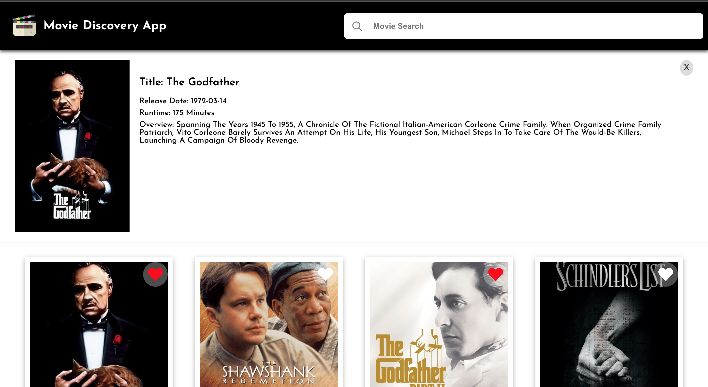

# Movie Discovery Web Application

<h1 align="center">
    
</h1>

## Overview
<p>This is a React-based movie discovery web application that allows users to search for movies, view movie details, and check their favorite movies. The application consumes data from the TMDB API to display movie information.</p>

### Features
* Display the top 10 movies on the homepage.
* Search for movies by title.
* Display search results with movie posters, titles, and release dates.
* Show loading indicators while fetching search results.
* View detailed movie information including title, release date, runtime, and overview.
* Error handling to display meaningful error messages in case of API failures.

## Technologies Used
* React: Front-end library for building user interfaces.
* Axios: HTTP client for making API requests.
* Styled-components: CSS-in-JS library for styling components.
* TMDB API: The Movie Database API for fetching movie data.


## Getting Started
1. Clone the repository:
```
git clone https://github.com/Angiephoenix/movie-discovery-app.git
```

2. Install dependencies:
```
cd movie-discovery-app
npm install
```

3. Obtain a TMDB API key by signing up at <a href="https://developer.themoviedb.org/docs">TMDB API</a> and replace `'apiKey'` in `App.js` and `MovieDetails.js` with your API key.

4. Start the development server:
```
npm start
```
Open the application in your web browser: http://localhost:3000

## Project Structure
* `src/components`: Contains React components for the application.
    * `App.js`: Main component for the application, including movie search and display.
    * `MovieCard.js`: Component for displaying movie cards.
    * `MovieDetails.js`: Component for displaying detailed movie information.
* `src/images`: Contains image assets used in the application.
* `src`: Other application files and configurations.

## API Integration
The application fetches movie data from the TMDB API using Axios. API endpoints are defined in the `fetchData` function in `App.js` and `useEffect` in `MovieDetails.js`.

<h1 align="center">
    
</h1>

<!-- ## Contributing
Contributions are welcome! If you'd like to contribute to the project, please follow these steps:

1. Fork the repository.
2. Create a new branch for your feature or bug fix:
```
git checkout -b feature-name
```
3. Make your changes and commit them:
```
git commit -m "Your commit message"
```
4. Push your changes to your fork:
```
git push origin feature-name
```
5. Create a pull request from your fork to the main repository. -->